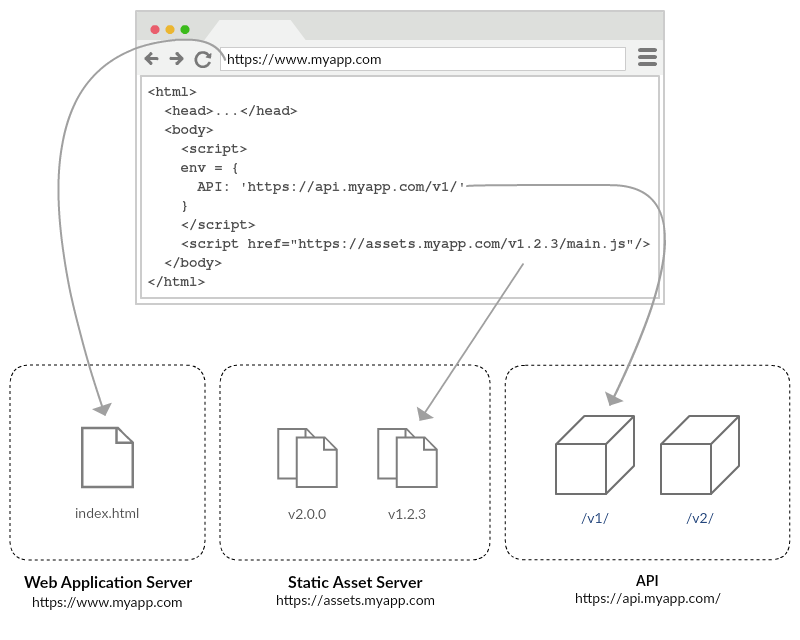

#  Immutable Web Apps

##  Introduction

_Immutable Web Applications_ is a framework-agnostic methodology for building and deploying static [single-page applications](https://en.wikipedia.org/wiki/Single-page_application) that:

- Minimizes risk and complexity of live releases.
- Simplifies and maximizes caching.
- Minimizes the need for servers and administration of runtime environments.
- Enables continuous delivery through simple, flexible, atomic deployments.

##  Principles We Work On

The methodology is based on the principles of ___strictly separating___:

- Configuration from code.
- Release tasks from build tasks.
- Dynamic content from static content.

##  Concepts

The following concepts define the core requirements for an _Immutable Web Application_. They are framework and infrastructure agnostic.

### Static assets are independent of the web application environment(s)

Static assets are the files (javascript, css, images) that are generated from a build of a web application codebase. They become _immutable_ when they do not contain anything environment-specific and they are published to a unique, independent location.

#### Static assets must not contain anything that is environment-specific

All of the leading application frameworks ([Angular CLI](https://github.com/angular/angular-cli/wiki/stories-application-environments), [Create React App](https://cli.vuejs.org/guide/mode-and-env.html#using-env-variables-in-client-side-code), [Ember CLI](https://ember-cli.com/user-guide/#Environments), [Vue CLI 3](https://cli.vuejs.org/guide/mode-and-env.html#using-env-variables-in-client-side-code)) recommend defining environment _values_ at _compile time_. This practice requires that the static assets are generated for each environment and regenerated for any change to an environment.

_Immutable Web Applications_ reference environment _variables_ that are defined on the global scope and reference one of two ways:

- Directly from the `window` object
- Through an injected service that wraps the environment variables

```diff
  export class UserService {
    webServiceUrl: String;

    constructor(
        private http: HttpClient
        ) {
-         // remove any configuration that is hardcoded or included during compilation
-         this.webServiceUrl = 'https://api.myapp.com'
+         // use globally scoped environment variables that are unique to the deployment
+         this.webServiceUrl = window.env.API
        }

    getUsers() {
      return this.http.get(`${this.webServiceUrl}/users`);
    }
  }
```

The values for the environment _variables_ are set on an `index.html` that is unique to each environment.

#### Static assets must be hosted at locations that are unique and _independent of the web application environment(s)_.

Static assets that do not contain anything environment-specific can be built once, published to a unique location, and then used in multiple environments of the web application.

These static assets share the same qualities as hosted javascript libraries on content delivery networks (CDN) ([Google Hosted Libraries](https://developers.google.com/speed/libraries/), [cdnjs](https://cdnjs.com/), [jsDelivr](https://www.jsdelivr.com/), [UNPKG](https://unpkg.com/)):

<code>https:/<span></span>/<span style="font-weight: bold">ajax.googleapis.c<span></span>om</span>/ajax/libs/jquery/<span style="font-weight: bold">3.3.1</span>/jquery.min.js</code>

The location of the jquery library above, referenced by innumerable web applications, is both independent of the applications and uniquely versioned.

<code>https:/<span></span>/<span style="font-weight: bold">assets.myapp.c<span></span>om</span>/apps/<span style="font-weight: bold">1.0.2</span>/main.js</code>

Similarly, the location of the web application javascript files are unique and hosted at a location that is dedicated to static assets. The static asset web server is a repository for versions of the web application.

#### Configure the static assets for long-term caching

Static assets that do not contain anything environment-specific and  are hosted at a unique and permanent location may be configured to be [cached by the browser (almost) indefinitely](https://developer.mozilla.org/en-US/docs/Web/HTTP/Headers/Cache-Control#Caching_static_assets):

 `cache-control: public, max-age=31536000, immutable`

### `index.html` is deployable configuration

 The HTML document of a single-page application (often `index.html`) is ___not___ static. It varies from environment to environment, and deploy to deploy. The HTML document is a composition of the environment-specific configuration and _immutable_ static assets that define the web application.

#### `index.html` contains fully-qualified references to the static assets

```diff
- <!-- not unique, not independent -->
- <script src="main.js" type="text/javascript"></script>

+ <!-- permanent, reuseable -->
+ <script src="https://assets.myapp.com/apps/1.0.2/main.js" type="text/javascript"></script>
```

#### `index.html` defines the values of the globally scoped environment variables

```html
<script>
env = {
    API: 'https://api.myapp.com',
    GA: 'UA-126263119-1'
}
</script>
```

#### `index.html` must never be cached

To allow for web application environments to be changed instantly, `index.html` must [never be cached by the browser or a public cache that cannot be purged on-demand:](https://developer.mozilla.org/en-US/docs/Web/HTTP/Headers/Cache-Control#Preventing_caching)

`cache-control: no-store`

##### _Example_

The `index.html` of most single-page web applications is typically a small document. By including versioned references to the web application static assets and setting the environment variables it is effectively a deployment manifest:

```html
<!doctype html>
<html lang="en">
<head>
    <meta charset="utf-8">
    <title>My App</title>
    <base href="/">
    <meta name="viewport" content="width=device-width, initial-scale=1">
    <link rel="icon" type="image/x-icon" href="favicon.ico">
</head>
    <body>

        <!-- environment variables -->
        <script>
        env = {
            API: 'https://api.myapp.com',
            GA: 'UA-126263119-1'
        }
        </script>

        <!-- application binding -->
        <app-root></app-root>

        <!-- fully-qualified static assets -->
        <script src="https://assets.myapp.com/apps/1.0.2/main.js" type="text/javascript"></script>

    </body>
</html>
```

##  Workflow

The _Immutable Web App_ separates release tasks from build tasks into two distinct workflows.

### Building

The codebase of an _Immutable Web App_ has the responsibility of building static assets and publishing them to a static web server. Each state of the codebase can be represented by a set of static assets at a unique location. Not every state of the codebase needs to be published, but no single state of the codebase should ever need to be published more than once.

Generally the codebase is a source controlled code repository integrated with a continuous integration system that is capable of building, versioning, and publishing static assets to a static web server.

_An example of this might be:_

An __Angular__ project hosted in a __GitHub__ repo. The repo is integrated with __TravisCI__ to build and version assets when commits are pushed to the master branch. Versioned assets are published to a unique location in an __AWS S3 bucket__.

### Releasing

The `index.html` files are managed independently of the codebase and they serve as a manifest for each environment. They should be considered configuration files and managed accordingly. Additionally, There needs to be a mechanism for modifying or replacing the `index.html` in each web application environment. The act of changing an `index.html` is effectively a deployment.

_An example of this might be:_

A set of `index.html` files, one for each environment, hosted in a __Github__ repo. The repo is integrated with __TravisCI__ to publish an `index.html` file when it is modified to an __AWS S3 bucket__. There is an `index.html` and S3 bucket dedicated to each web application environment.

### Infrastructure



The infrastructure to support _Immutable Web Apps_ is composed of three parts:

- __Web Application Server__: A static web server to host a web application environment by serving `index.html`.
- __Static Asset Server__: A static web server to host the immutable static assets.
- __API__: One or more publicly exposed endpoints to interact with the web application backend.

The two static web servers have different behaviors:

| | Web Application Server | Static Asset Server |
| --- | --- | --- |
| Content | `index.html` | Static assets (`*.js`,`*.css`, images, etc)|
| Routing | always `index.html` | the physical file at the Url |
| Cache-Control | `no store` | `cache-control: public, max-age=31536000, immutable` |
| Instances | One per web application environment | One per web application

##  Benefits

### Promoted deployments

Building static assets is a complicated process that often involves:

- Resolving dependencies
- Downloading libraries
- Transpiling
- Minifying
- Bundling
- Uglifying, Code Splitting, Tree Shaking, Autoprefixing... the list goes on...

These processes are time consuming, rely heavily upon external dependencies, and often behave in a seemingly non-deterministic way. They are not processes that should be concluded by immediately publishing the generated assets to a production environment without validation. Even the act of publishing the multiple large static assets is a process that may be interrupted and leave the web application environment in a corrupt state.

_Immutable Web Applications_ are generated once and published once to a permanent location. This process happens in advance of a live release. They can be validated in staging environments and promoted to the production environment without being regenerated at significantly lower risk.

### Atomic live releases

A live releases of an _Immutable Web App_ is the act of publishing a single `index.html` file. The deployment is instantaneous and all assets are available immediately without any risk of cache being corrupted at the time of the release.

Rollbacks are as risky as deployments and often riskier. For _Immutable Web Apps_, the same qualities of a deploy apply to a rollback. Notably, in the event of a rollback most browsers will still have the previous assets cached.

In the unlikely event that a browser attempts to load a stale version of `index.html`, all of the assets of the previous version will still be available and uncorrupted.

### Simplified caching

Managing `cache-control` headers can be intimidating, especially when the web application infrastructure leverages public caches like the ones used by CDNs. The two simplest concepts in caching are: "Always cached", and "Never cached". _Immutable Web Apps_ embraces these concepts completely separating and the code that can be "Always cached" from configuration that is "Never cached".

### Simplified routing

The leading application frameworks do not separate the location of static assets from the `index.html` in their [deployment recommendations](https://angular.io/guide/deployment#server-configuration). Instead, they recommend adding routing rules to the web server that returns `index.html` for all paths that do not resolve to a physical file. The implementation of these routing rules may differ between web servers and mistakes often result in paths that resolve to the wrong resource.

Separating the hosting of `index.html` and the static assets eliminates this risk. The static assets server always serves a physical file represented by the url and the web application server always serves `index.html` for any url.

##  Background

_Immutable Web Applications_ methodology builds on several trends in web application development:

- __Modern Application Frameworks:__ Angular, React, Vue, and Ember have enabled teams to build increasingly complex single-page static apps. Tools like webpack have improved the ability to create, optimize, and manage build artifacts.

- __DevOps:__ The culture of DevOps has enabled web application developers to decompose and reevaluate their web application infrastructure to better serve the requirements of their web applications.

- __Maturing Application Patterns & Practices:__ Backend applications and services are converging around a set of best practices that support portability, scalability, and high availability. This trend has dramatically increased the tools and services available, especially related to containers and container orchestration. Many of these practices are just now starting to be applied to static single-page web applications.

##  Influences

 - [__The Twelve-Factor App__](https://12factor.net/): This methodology for building web apps is based on _separation of concerns_ in order to achieve portability and robustness. _Immutable Web Apps_ separate several of the same concerns in order to achieve similar objectives.

 - [__JAMstack__](https://jamstack.org/): The _Immutable Web Apps_ methodology is completely aligned with the [best practices](https://jamstack.org/best-practices/) of the JAMstack.

##  Projects

- [__ng-immutable-example__](https://github.com/ImmutableWebApps/ng-immutable-example): Converts a project generated by [Angular CLI](https://cli.angular.io/) into an Immutable Web App.

- [__react-immutable-example__](https://github.com/ImmutableWebApps/react-immutable-example): Converts a project generated by [Create React App](https://facebook.github.io/create-react-app/) into an Immutable Web App.

- [__unpkg-immutable-example__](https://github.com/ImmutableWebApps/unpkg-immutable-example): An example Immutable Web App hosted on [npm](https://www.npmjs.com/), [UNPKG](https://unpkg.com/#/), and [GitHub Pages](https://pages.github.com/).

- [__aws-lambda-edge-example__](https://github.com/ImmutableWebApps/aws-lambda-edge-example): Deploys an Immutable Web App to [AWS Lambda@Edge](https://aws.amazon.com/lambda/edge/) with [Serverless](https://serverless.com/).

##  Talks & Articles

- [_"Single-page App Deployments"_](https://www.meetup.com/nh-js-manchester/events/255671618/), Gene Connolly, [NH.js](https://www.meetup.com/nh-js-manchester/), November 14th 2018

- [_"Risk-free Deployments with Immutable Web Apps"_](https://underthehood.meltwater.com/blog/2018/12/03/risk-free-deployments-with-immutable-web-apps/), Gene Connolly, [underthehood.meltwater.com](https://underthehood.meltwater.com), December 3rd 2018

##  Future Work

_Immutable Web Applications_ is not yet actively supported by any application framework, tools, or services. Most static, single-page applications should be able to adopt the _Immutable Web Applications_ methodology by making several minor structural changes to the codebase, build process, and infrastructure. Until there is widespread support, however, web applications that use advanced [code-splitting](https://webpack.js.org/guides/code-splitting/) techniques may find adoption to be complicated or impractical.

Achieving widespread support will require:

- __Building tutorials, documentation, and examples__ of how to build _Immutable Web Applications_ using the leading application frameworks and tools.

- __Proposing changes to existing frameworks and tools__ to support _Immutable Web Applications_.

- __Advocacy and education__ of _Immutable Web Applications_ through blog posts and presentations.

##  Acknowledgements

_Immutable Web Apps_ was developed based on the research and experiences building web applications at [Meltwater](https://www.meltwater.com/). Learn more about the things we are doing at our engineering blog: [underthehood.meltwater.com](https://underthehood.meltwater.com/).

immutablewebapps@gmail.com
[@immutablewebapp](https://twitter.com/ImmutableWebApp)
